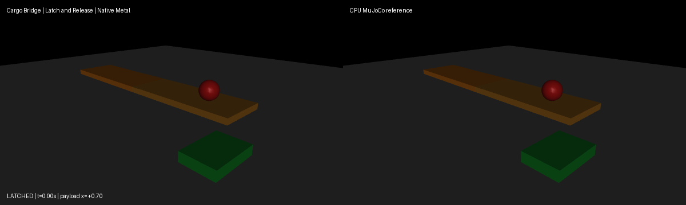
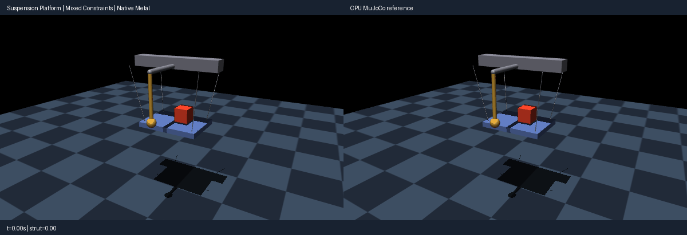
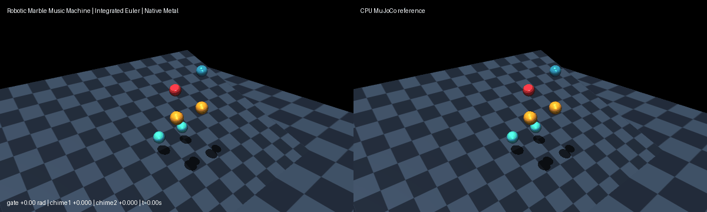
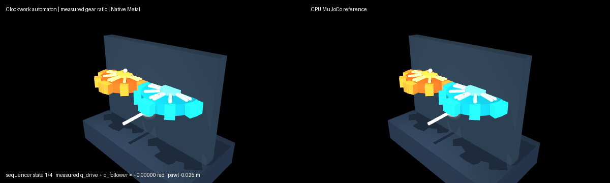
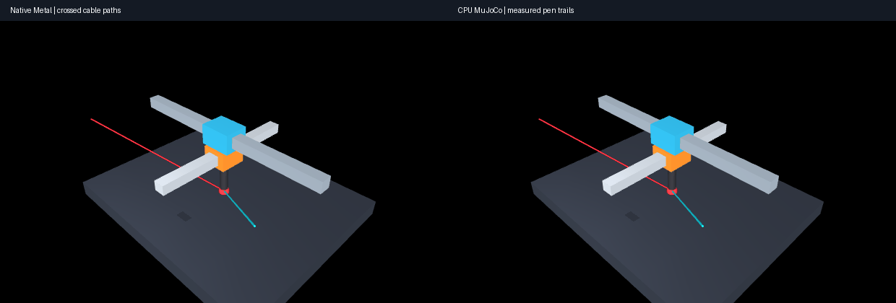
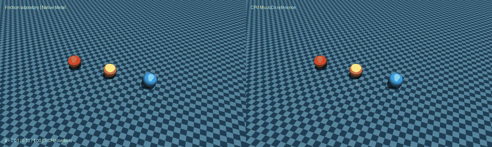
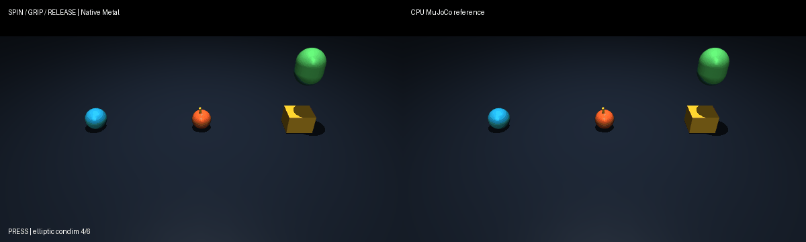
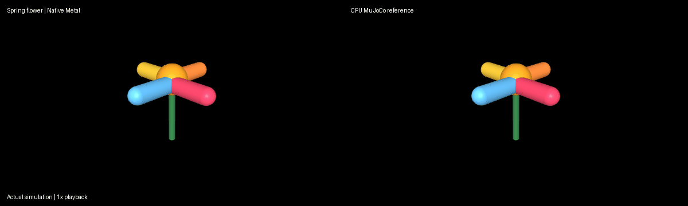
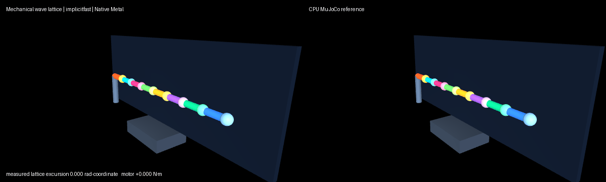
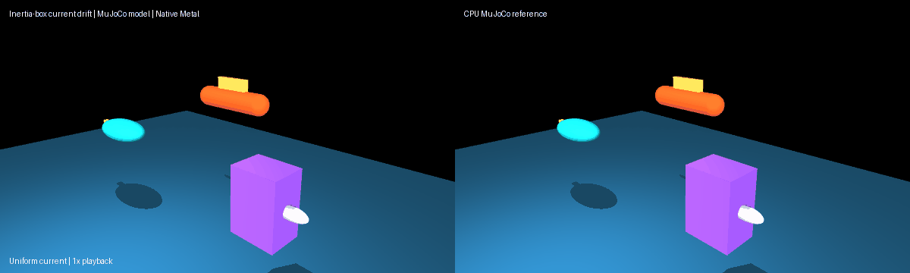

# MuJoCo Mac Metal

Experimental native Apple GPU physics for MuJoCo, maintained by
[keeeeenw](https://github.com/keeeeenw). This community project builds on
[Google DeepMind's MuJoCo](https://github.com/google-deepmind/mujoco) and adds an
optional [Metal package](metal/README.md). It is not an official MuJoCo release.

**Native stepping works for explicit, bounded model profiles. Full MuJoCo
Metal support remains a work in progress.** The ordinary MuJoCo build remains
available alongside the optional package.

## Our contributions

- **Native Metal physics pipeline:** model-derived forward kinematics, dense mass
  matrices and inertial/gravity bias, a dense Cholesky acceleration solve, and
  quaternion-aware semi-implicit Euler integration. Hinge, slide, ball and free
  joints are supported within the explicit `contact_free_euler_v1` profile.
- **Persistent GPU simulation state:** batched stepping without CPU physics or
  per-step host state readback, per-world failure handling, selected-row reset,
  and checkpoint ownership/restore. Host-side lifecycle utilities also cover
  model-constant recomputation and invalidation.
- **Expanded source coverage:** connect/weld equalities with runtime activation,
  per-environment mocap and keyframe/state restoration, stateful actuator families,
  spatial tendons with wrapping and site-only armature bias, and ball-joint limits.
  These features extend the bounded integrated Euler profile; they do not imply
  full MuJoCo compatibility.
- **Qualification:** **518 native GPU tests passed** in the recorded physics
  qualification, and **215 CPU tests passed** in the final publication check
  (304 GPU-dependent checks skipped in the no-Torch environment). See the
  [validation results and limits](metal/QUALIFICATION.md) for test scope,
  reproducibility and outstanding checks.
- **Forces and controls:** explicit generalized-force and linear-damping support,
  plus bounded hinge/slide motors with clipping and disable flags. Separate
  profiles preserve the original unforced baseline.
- **Integrated physics on main:** `integrated_euler_v1` combines contacts,
  actuation, fixed tendons, passive forces, fluid drag, scalar joint constraints
  and sensor queries in one pipeline. Primitive collisions cover all nine valid
  pairs among planes, spheres, capsules and boxes, including multi-point manifolds.
- **Sliding, spinning and rolling friction:** contact dimensions 1/3/4/6 support
  pyramidal and elliptic cones, anisotropic coefficients and explicit contact
  pairs. Contact and joint constraints share one coupled solve, with independent
  force, residual, trajectory and failure-recovery checks. Try the new
  [Spin-and-Grip arcade](metal/examples/spin_and_grip.md).
- **Additional bounded profiles:** RK4 and implicitfast, springs and body forces,
  inertia-box fluid drag, fixed-tendon servos and selected sensor queries.
  See [precise coverage and limits](metal/DEVELOPMENT.md). Integrated physics and
  expanded primitive/friction support require the source checkout; they are not
  included in the published 0.4.0 wheel.
- **Tools and documentation:** creative simulation demos, capability inventory,
  runtime/shader provenance, Apple Silicon FAQ, and a portable benchmark runner.
- **Upstream regression coverage:** an `mj_setConst` inertial-update roundtrip test
  and documentation clarifying compiled simple-body/sparsity limitations.

These contributions implement and qualify existing dynamics and numerical
methods on Metal; MuJoCo's physics methods and PPO/RL algorithms are not our
inventions. See [LICENSE](LICENSE) and [Metal attribution](metal/NOTICE).

## Measured performance on M1 Max

For the contact-free four-DOF pendulum on an **M1 Max with 32 GB unified memory**,
200 steps at 524,288 environments took **18.905 s on eight-thread CPU rollout
versus 5.907 s on Metal: 3.20x faster**, reaching **17.75 million world-steps/s**.
CPU wins at small batches; gains level off at large batches.

This is a short physics API benchmark, not a walking or PPO training result.
CPU rollout records float64 trajectories; Metal retains float32 device state.
Those different precision and output costs are included in the comparison.
[Complete results, raw trials and reproduction commands](metal/benchmarks/README.md)
explain the measurement boundaries.

## Install and check

In an isolated Python 3.12 environment, install the experimental release from PyPI:

```sh
python -m pip install mujoco-mac-metal
PYTORCH_ENABLE_MPS_FALLBACK=0 mujoco-metal doctor --gpu
```

[Version 0.4.0](https://pypi.org/project/mujoco-mac-metal/0.4.0/) includes the
earlier bounded physics profiles. Existing installations can upgrade with
`python -m pip install --upgrade mujoco-mac-metal`. Clone the repository for
the demo scripts and assets using the [source setup](metal/INSTALL.md#development-source).
See [installation and diagnostics](metal/INSTALL.md) for requirements and status.

## Try the Mac demos

We built these demos to explore Metal physics on the Mac—give them a try!
Each guide includes runnable commands and an independent CPU MuJoCo comparison.
Use the current `main` checkout and the [demo/source setup](metal/INSTALL.md#development-source).
The integrated demos below, including the new crane, gripper and drawbridge,
require this source installation; the published 0.4.0 wheel is insufficient.
The repository contains the scripts, models and GIFs; the wheel contains the
physics package and its shaders.

The clips show actual simulation at a presentation playback rate, not measured
execution speed. Rendering uses MuJoCo OpenGL. Most examples offer headless
checks and GIF recording; interactive viewing is documented where available.
The [compact gallery](metal/examples/demo_gallery.md) maps each demo to its
physics capability.

### [Muscle-powered gripper](metal/examples/muscle_gripper.md)

A muscle-driven parallel-jaw gripper delivers a ball into a bin and places a second ball on a
pedestal, exercising stateful actuation and contact-rich manipulation. The guide
reports both successful behavior and numerical comparison boundaries.


### [Cable drawbridge](metal/examples/cable_drawbridge.md)

A winch hauls, releases and re-tensions a routed cable around a cylindrical
bollard and pulley, lifting a deck and its payload. This demonstrates spatial
tendon wrapping, spring/damping forces and a stateful actuator.


### [Magnetic crane](metal/examples/magnetic_crane.md)

A prescribed mocap hook carries welded cargo and releases it into a bin,
combining mocap inputs, runtime equality activation and keyframe reset.


### [Latch-and-release cargo bridge](metal/examples/cargo_bridge.md)

Two connected deck sections release a weld brace and settle onto a solid stop
while carrying a payload, exercising coupled connect/weld constraints and contact dynamics.



### [Suspension platform](metal/examples/suspension_platform.md)

A cable-supported platform and payload exercise tendon constraints and
ball-joint limits. See the guide for the bounded configuration and comparison.



### [Clockwork parcel sorter](metal/examples/clockwork_parcel_sorter.md)

Real box parcels, capsule rollers, and swinging diverter gates routing parcels to bins demonstrate complete primitive collisions: multi-contact manifolds across all pairs of planes, spheres, capsules, and boxes coupled with joint equality, tendons, actuation, limits, and live sensor queries in one unified solve.


### [Robotic marble music machine](metal/examples/marble_music_machine.md)

Dual selector gates and resonant chime bars struck by descending marbles demonstrate the integrated Euler pipeline: motor actuation, fixed tendons, passive resonant springs, fluid drag, joint limits, dry friction, polynomial equality, and pyramidal contacts coupled in one solve.



### [Off-center balance workshop](metal/examples/offcenter_balance.md)

L-shaped tools spin around nearly stationary centers of mass. Independent orbit plots show free-body midpoint integration with offset inertias.


### [Clockwork automaton](metal/examples/clockwork_automaton.md)

Counter-rotating gears and a sequenced pawl exercise joint equality, limits and dry friction. The gear teeth are visual; contacts are disabled.



### [Crossed-cable plotter](metal/examples/cable_plotter.md)

Two fixed-joint tendon servos guide a pen along a figure-eight path, leaving measured trails. The cable lines illustrate the transmission; they are not wrapping-cable physics.



### [Friction laboratory](metal/examples/friction_laboratory.md)

Three marbles with different friction coefficients transition from sliding to rolling, exercising pyramidal friction contact.



### [Spin-and-Grip arcade](metal/examples/spin_and_grip.md)

A rolling sphere, spinning sphere and actuated press demonstrate rolling
resistance, torsional friction and frictional hold/release. The elliptic scene
uses condim 6 for rolling, 4 for spin and 3 for the press/object contact.



### [Marble cascade](metal/examples/marble_cascade.md)

Marbles slide and collide on a tilted plane using plane–sphere and sphere–sphere normal contacts.


### [Spring flower](metal/examples/kinetic_sculpture.md)

Spring-driven petals fold and sway under damping, gravity compensation and applied body forces.



### [Mechanical wave lattice](metal/examples/wave_lattice.md)

A motor drives a colorful articulated chain, exercising coupled springs, damping and implicitfast integration.



### [Current-driven bodies](metal/examples/fluid_buoys.md)

Colorful bodies drift and rotate in a current using inertia-box fluid drag and viscosity. This does not model buoyancy or geom-level fluid lift.



### [Sensor scanning rig](metal/examples/scanning_rig.md)

A pan/tilt scanner plots current-state pose and velocity measurements. The target is a frame reference; the demo does not ray cast or measure depth.


### [Tumbling toys](metal/examples/tumbling_toys.md)

Asymmetric toys spin around different axes, demonstrating quaternion-aware RK4 integration.


### [Spacecraft approach](metal/examples/space_docking.md)

Three craft chase moving markers under host controls, applied forces and damping. Native Metal advances the physics; docking contacts and latches are not modeled.


### [Chaotic pendulum](metal/examples/README.md)

Four connected arms swing and tumble. This recorded clip uses **Metal mass/bias
with CPU solve and integration** on the left and CPU MuJoCo on the right.
The same demo also offers fully native contact-free physics with `--mode metal`.
Native headless/offscreen checks passed; native interactive playback still needs
qualification with an active macOS display.


## Current limits and next steps

The optional package targets Python 3.12, MuJoCo **3.10.0** and Torch **2.9.1**;
use its isolated installation instructions rather than treating the newer
surrounding MuJoCo source version as the qualified runtime.

Version **0.4.0** contains earlier bounded profiles. Current `main` additionally
includes integrated primitive contact/friction, connect/weld and tendon
constraints, equality activation, mocap/keyframe support, stateful actuation,
spatial tendon wrapping, site-only tendon armature and ball-joint limits.
These additions require a source installation and have not been released to PyPI.

Integrated stepping remains bounded to **32 velocities, 16 candidate pairs,
24 contact slots and 96 constraint rows**. Contacts cover planes, spheres,
capsules and boxes. Cylinder and ellipsoid **collision support is still in
progress and is not included on main**; cylinder tendon wrapping is a
separate supported operation. Mesh, heightfield and SDF contacts, flex/deformables,
no-slip solving, full implicit integration, and remaining sensor/model/API
features still need implementation or qualification. Wrapped tendon armature
remains unsupported. Sensor queries do not reproduce every stored step-stage
sensor timing behavior.

The closeout has source-level shader inventory checks; built-wheel content
validation for these new features is still pending. Interactive viewer validation
requires a display and remains a separate qualification step. Native rendering,
RL training integration, robot deployment, Linux/CUDA integration and broad Mac
hardware/OS validation remain outside this qualification. Per-environment model
randomization is not connected to native stepping. No new speedup is claimed.

Next work completes collision geometry, solver/integrator coverage, sensors,
model/API behavior and scalable workspaces. See the
[development coverage](metal/DEVELOPMENT.md) and
[pinned support inventory](metal/COVERAGE.md) for exact feature boundaries.
See the [API contracts](metal/API.md) and [Apple Silicon FAQ](metal/FAQ.md)
for usage details and common questions.

## Contribute

Community testing, code review and pull requests are welcome—especially numerical
edge cases, other Apple hardware, better matched CPU/GPU benchmarks, and ideas
for code structure. Follow [CONTRIBUTING.md](CONTRIBUTING.md) and include the model,
software versions and reproduction commands with reports.

Upstream proposals: [native Metal support #3626](https://github.com/google-deepmind/mujoco/pull/3626)
and [inertial-update regression #3624](https://github.com/google-deepmind/mujoco/pull/3624).
The broader request is [MuJoCo issue #95](https://github.com/google-deepmind/mujoco/issues/95).
The older robot-specific implementation remains on
[`archive/metal-microduck-v1`](https://github.com/keeeeenw/mujoco-mac-metal/tree/archive/metal-microduck-v1).

## Upstream MuJoCo

The following documentation describes the underlying upstream project. Its
installation and feature descriptions do not imply Metal acceleration.

<h1>
  <a href="#"></a>
</h1>

<p>
  <a href="https://github.com/google-deepmind/mujoco/actions/workflows/build.yml?query=branch%3Amain" alt="GitHub Actions">
    
  </a>
  <a href="https://mujoco.readthedocs.io/" alt="Documentation">
    
  </a>
  <a href="https://github.com/google-deepmind/mujoco/blob/main/LICENSE" alt="License">
    
  </a>
</p>

**MuJoCo** stands for **Mu**lti-**Jo**int dynamics with **Co**ntact. It is a
general purpose physics engine that aims to facilitate research and development
in robotics, biomechanics, graphics and animation, machine learning, and other
areas which demand fast and accurate simulation of articulated structures
interacting with their environment.

Upstream MuJoCo is maintained by [Google DeepMind](https://www.deepmind.com/).

MuJoCo has a C API and is intended for researchers and developers. The runtime
simulation module is tuned to maximize performance and operates on low-level
data structures that are preallocated by the built-in XML compiler. The library
includes interactive visualization with a native GUI, rendered in OpenGL. MuJoCo
further exposes a large number of utility functions for computing
physics-related quantities.

We also provide [Python bindings] and a plug-in for the [Unity] game engine.

## Documentation

MuJoCo's documentation can be found at [mujoco.readthedocs.io]. Upcoming
features due for the next release can be found in the [changelog] in the
"latest" branch.

## Getting Started

There are two easy ways to get started with MuJoCo:

1. **Run `simulate` on your machine.**
[This video](https://www.youtube.com/watch?v=P83tKA1iz2Y) shows a screen capture
of `simulate`, MuJoCo's native interactive viewer. Follow the steps described in
the [Getting Started] section of the documentation to get `simulate` running on
your machine.

2. **Explore our online IPython notebooks.**
If you are a Python user, you might want to start with our tutorial notebooks
running on Google Colab:

 - The **introductory** tutorial teaches MuJoCo basics:
   [](https://colab.research.google.com/github/google-deepmind/mujoco/blob/main/python/tutorial.ipynb)
 - The **Model Editing** tutorial shows how to create and edit models procedurally:
   [](https://colab.research.google.com/github/google-deepmind/mujoco/blob/main/python/mjspec.ipynb)
 - The **rollout** tutorial shows how to use the multithreaded `rollout` module:
   [](https://colab.research.google.com/github/google-deepmind/mujoco/blob/main/python/rollout.ipynb)
 - The **LQR** tutorial synthesizes a linear-quadratic controller, balancing a
   humanoid on one leg:
   [](https://colab.research.google.com/github/google-deepmind/mujoco/blob/main/python/LQR.ipynb)
 - The **least-squares** tutorial explains how to use the Python-based nonlinear
   least-squares solver:
   [](https://colab.research.google.com/github/google-deepmind/mujoco/blob/main/python/least_squares.ipynb)
 - The **MJX** tutorial provides usage examples of
   [MuJoCo XLA](https://mujoco.readthedocs.io/en/stable/mjx.html), a branch of MuJoCo written in JAX:
   [](https://colab.research.google.com/github/google-deepmind/mujoco/blob/main/mjx/tutorial.ipynb)
 - The **differentiable physics** tutorial trains locomotion policies with
   analytical gradients automatically derived from MuJoCo's physics step:
   [](https://colab.research.google.com/github/google-deepmind/mujoco/blob/main/mjx/training_apg.ipynb)

## Installation

### Prebuilt binaries

Versioned releases are available as precompiled binaries from the GitHub
[releases page], built for Linux (x86-64 and AArch64), Windows (x86-64 only),
and macOS (universal). This is the recommended way to use the software.

### Building from source

Users who wish to build MuJoCo from source should consult the [build from
source] section of the documentation. However, note that the commit at
the tip of the `main` branch may be unstable.

### Python (>= 3.10)

The native Python bindings, which come pre-packaged with a copy of MuJoCo, can
be installed from [PyPI] via:

```bash
pip install mujoco
```

Note that Pre-built Linux wheels target `manylinux2014`, see
[here](https://github.com/pypa/manylinux) for compatible distributions. For more
information such as building the bindings from source, see the [Python bindings]
section of the documentation.

## Versioning

We aim to release MuJoCo in the first week of each month. Our versioning
standards changed to modified Semantic Versioning in 3.5.0,
see [versioning](VERSIONING.md) for details.

## Contributing

We welcome community engagement: questions, requests for help, bug reports and
feature requests. To read more about bug reports, feature requests and more
ambitious contributions, please see our [contributors guide](CONTRIBUTING.md)
and [style guide](STYLEGUIDE.md).

## Asking Questions

Questions and requests for help are welcome as a GitHub
["Asking for Help" Discussion](https://github.com/google-deepmind/mujoco/discussions/categories/asking-for-help)
and should focus on a specific problem or question.

## Bug reports and feature requests

GitHub [Issues](https://github.com/google-deepmind/mujoco/issues) are reserved
for bug reports, feature requests and other development-related subjects.

## Related software
MuJoCo is the backbone for numerous environment packages. Below we list several
bindings and converters.

### Bindings

These packages give users of various languages access to MuJoCo functionality:

#### First-party bindings:

- [Python bindings](https://mujoco.readthedocs.io/en/stable/python.html)
  - [dm_control](https://github.com/google-deepmind/dm_control), Google
    DeepMind's related environment stack, includes
    [PyMJCF](https://github.com/google-deepmind/dm_control/blob/main/dm_control/mjcf/README.md),
    a module for procedural manipulation of MuJoCo models.
- [JavaScript bindings and WebAssembly support](/wasm/README.md) (inspired [stillonearth](https://github.com/stillonearth) and [zalo](https://github.com/zalo)'s community projects; [mjswan](https://github.com/ttktjmt/mjswan) extends these with real-time policy control, interactive force
application, and more).
- [C# bindings and Unity plug-in](https://mujoco.readthedocs.io/en/stable/unity.html)

#### Third-party bindings:

- **MATLAB Simulink**: [Simulink Blockset for MuJoCo Simulator](https://github.com/mathworks-robotics/mujoco-simulink-blockset)
  by [Manoj Velmurugan](https://github.com/vmanoj1996).
- **Swift**: [swift-mujoco](https://github.com/liuliu/swift-mujoco)
- **Java**: [mujoco-java](https://github.com/CommonWealthRobotics/mujoco-java)
- **Julia**: [MuJoCo.jl](https://github.com/JamieMair/MuJoCo.jl)
- **Rust**: [MuJoCo-rs](https://github.com/davidhozic/mujoco-rs)

### Converters

- **OpenSim**: [MyoConverter](https://github.com/MyoHub/myoconverter) converts
  OpenSim models to MJCF.
- **SDFormat**: [gz-mujoco](https://github.com/gazebosim/gz-mujoco/) is a
  two-way SDFormat <-> MJCF conversion tool.
- **OBJ**: [obj2mjcf](https://github.com/kevinzakka/obj2mjcf)
  a script for converting composite OBJ files into a loadable MJCF model.
- **onshape**: [Onshape to Robot](https://github.com/rhoban/onshape-to-robot)
  Converts [onshape](https://www.onshape.com/en/) CAD assemblies to MJCF.

## Citation

If you use MuJoCo for published research, please cite:

```
@inproceedings{todorov2012mujoco,
  title={MuJoCo: A physics engine for model-based control},
  author={Todorov, Emanuel and Erez, Tom and Tassa, Yuval},
  booktitle={2012 IEEE/RSJ International Conference on Intelligent Robots and Systems},
  pages={5026--5033},
  year={2012},
  organization={IEEE},
  doi={10.1109/IROS.2012.6386109}
}
```

## License and Disclaimer

Copyright 2021 DeepMind Technologies Limited.

Box collision code ([`engine_collision_box.c`](https://github.com/google-deepmind/mujoco/blob/main/src/engine/engine_collision_box.c))
is Copyright 2016 Svetoslav Kolev.

ReStructuredText documents, images, and videos in the `doc` directory are made
available under the terms of the Creative Commons Attribution 4.0 (CC BY 4.0)
license. You may obtain a copy of the License at
https://creativecommons.org/licenses/by/4.0/legalcode.

Source code is licensed under the Apache License, Version 2.0. You may obtain a
copy of the License at https://www.apache.org/licenses/LICENSE-2.0.

This is not an officially supported Google product.

[build from source]: https://mujoco.readthedocs.io/en/latest/programming#building-from-source
[Getting Started]: https://mujoco.readthedocs.io/en/latest/programming#getting-started
[Unity]: https://unity.com/
[releases page]: https://github.com/google-deepmind/mujoco/releases
[mujoco.readthedocs.io]: https://mujoco.readthedocs.io
[changelog]: https://mujoco.readthedocs.io/en/latest/changelog.html
[Python bindings]: https://mujoco.readthedocs.io/en/stable/python.html#python-bindings
[PyPI]: https://pypi.org/project/mujoco/
