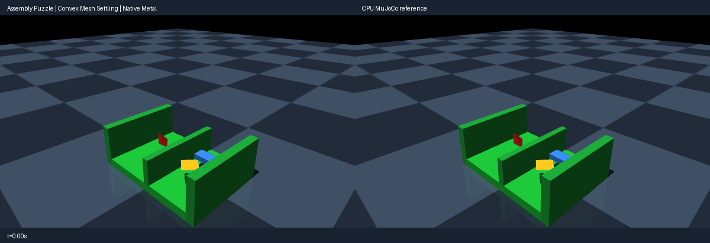

# Gravity assembly puzzle (convex mesh contact)

Use the [shared source setup](../INSTALL.md#development-source), with its Python
environment active, and run these commands from the repository root.
This integrated demo requires current main source; it is not supported by the
published 0.4.0 wheel alone.

Three procedural convex hulls (tetrahedron, brick, octahedron; authored
vertex lists) drop into a two-lane walled tray under gravity with Coulomb
friction. Piece/tray and piece/piece contacts exercise native convex-mesh
narrow phase (vertex-support GJK/MPR singles with face-snap readout) against
planes, boxes and other meshes. Rest equilibria with friction are
non-unique, so the check gates lane containment, impact-transient and
settle envelopes plus pre-impact parity, not exact rest poses. Native
single-witness face contacts answer softer than multi-point CPU manifolds;
the tray lanes contain the resulting bounce. Rendering uses MuJoCo OpenGL;
playback speed is presentation only, not a physics throughput claim.

Run a CPU reference smoke test:

```bash
PYTHONPATH=metal python metal/examples/assembly_puzzle.py --mode cpu --headless --check --steps 600
```

Run the native Metal comparison check on an Apple Silicon Mac:

```bash
PYTORCH_ENABLE_MPS_FALLBACK=0 PYTHONPATH=metal:metal/examples python metal/examples/assembly_puzzle.py --headless --check --steps 600
```

Record the side-by-side native Metal and CPU MuJoCo renders (left panel native,
right CPU):

```bash
PYTORCH_ENABLE_MPS_FALLBACK=0 PYTHONPATH=metal:metal/examples python metal/examples/assembly_puzzle.py --record metal/examples/assets/assembly_puzzle.gif --steps 600
```



The `--headless --check` run asserts actual native behavior: all three pieces
settle inside their tray lanes below rim height, pre-impact flight parity is
exact, settled end positions agree to lane precision, and piece penetration
stays within the compliant impact bound. Multi-basin deep-rotated mesh-mesh
overlap is excluded from tight parity (matrix documents the regime).

Lighting and the dark checkerboard match the robotic marble music machine.
