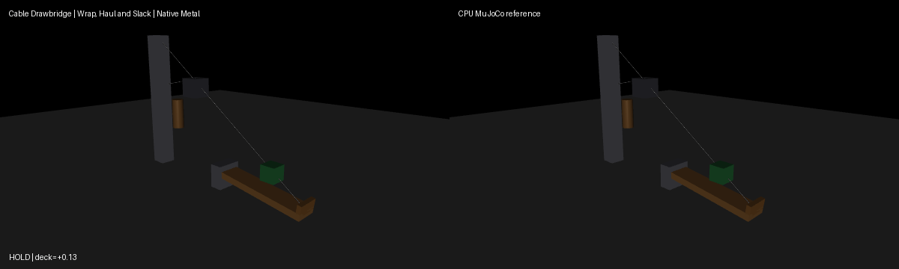

# Cable drawbridge (spatial tendon wrapping)

Use the [shared source setup](../INSTALL.md#development-source), with its Python
environment active, and run these commands from the repository root.
This integrated demo requires current main source; it is not supported by the
published 0.4.0 wheel alone.

A counterweight winch hauls a cable routed from the winch site around a
bollard cylinder wrap (with side-site selection), through a tower site, over a
pulley (divisor 3), to a hinged deck tip and a tower anchor. The tendon carries
spring/damper passive forces with a rest range, so the cable goes genuinely
slack when the winch releases and re-tensions on the next haul. A filter
actuator drives the winch open-loop: haul (tension, raise deck with its crate
payload), release (slack, lower deck), re-haul (re-tension, raise again).
A paired constant-slack run shows the deck never rises without hauling.
The simulation starts from the compiled `start` keyframe via
`sim.reset_to_keyframe`. Rendering uses MuJoCo OpenGL; playback speed is
presentation only, not a physics throughput claim.

Run a CPU reference smoke test:

```bash
PYTHONPATH=metal python metal/examples/cable_drawbridge.py --mode cpu --headless --steps 1400
```

Run the native Metal comparison check on an Apple Silicon Mac:

```bash
PYTORCH_ENABLE_MPS_FALLBACK=0 PYTHONPATH=metal:metal/examples python metal/examples/cable_drawbridge.py --headless --check --steps 1400
```

Record the side-by-side native Metal and CPU MuJoCo renders (left panel native,
right CPU):

```bash
PYTORCH_ENABLE_MPS_FALLBACK=0 PYTHONPATH=metal:metal/examples python metal/examples/cable_drawbridge.py --record metal/examples/assets/cable_drawbridge.gif --steps 1400
```

Launch the interactive viewer on a Mac (requires a display; headless
verification uses `--headless --check` plus the GIF above):

```bash
./run mjpython metal/examples/cable_drawbridge.py --steps 1400
```

Add `--viewer-seconds 20` to auto-close after 20 s of wall time for explicit
visual checks (without it, the viewer runs the finite `steps` rollout, then
closes; interactive visual validation additionally requires a display and is
otherwise unverified here).



The `--headless --check` run asserts actual native behavior: native/CPU pose
parity over the full haul/slack/re-haul rollout, deck raised past -0.3 rad,
deck lowered past +0.05 rad during a genuinely slack interval (cable length
below rest), hundreds of taut steps and dozens of slack steps, crate lifted
past 0.35 m with the deck, final re-raised state and a hold-only
counterfactual that never rises.

Measured CPU results on the qualified run (MuJoCo 3.10.0):

- Deck minimum (raised): `-0.674` rad; deck maximum during slack window: `+0.157` rad.
- Cable: `1025` taut steps, `375` slack steps (zero spring force).
- Crate peak height: `0.535` m (rode the deck up from `0.28` m).
- Final re-raised deck: `-0.651` rad; hold-only deck: `+0.131` rad.
- Full-run native/CPU parity: translations `7.4e-03` (single crate-shift
  transient at step 651, reconverges to `4.1e-03`), crate orientation `3.7e-02`
  (same transient), actuator state `5e-4`. Position/orientation reported
  separately per the roadmap; the transient is a contact event, not drift.
