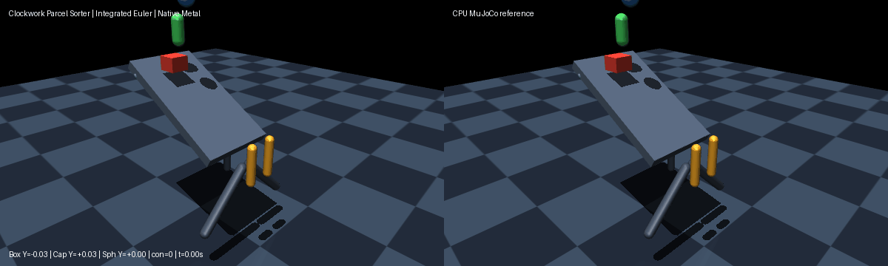

# Clockwork parcel sorter

Use the [shared source setup](../INSTALL.md#development-source), with its Python
environment active, and run these commands from the repository root.

This example showcases complete primitive collision support in the integrated native Metal Euler pipeline (`integrated_euler_v1`),
combining multi-contact manifolds across planes, spheres, capsules, and boxes with motor actuation,
polynomial joint equality, fixed tendons, joint limits, frictionloss, and live sensor queries—all
solved in one coupled Delassus PGS constraint solve per step.

The sorter features:
- A solid box feed ramp where mixed parcels descend under gravity and Coulomb friction.
- A mixed parcel feed comprising real box parcels (40x40x30 mm), capsule parcels, and sphere parcels.
- An actuated swinging diverter gate driven by a rhythmic clockwork motor torque.
- A follower diverter gate synchronized symmetrically via a polynomial joint equality constraint.
- A passive spring/damper lever coupled to the diverter mechanism via a fixed tendon.
- Multi-contact primitive manifolds across all valid pairs: box-box face/edge contact (up to 8 points), capsule-box (2 points), capsule-capsule (2 points), sphere-box (1 point), sphere-capsule (1 point), and sphere-plane (1 point).
- Dynamic parcel-to-parcel interactions (`box_parcel_geom <-> cap_parcel_geom`) demonstrating stacking and collision deflection.
- Actual physical routing directing the box parcel to the left chute ($Y < -0.1$), the capsule parcel to the right chute ($Y > 0.1$), and the sphere parcel along the center track ($|Y| < 0.05$).

Run a CPU reference smoke test:

```bash
PYTHONPATH=metal python metal/examples/clockwork_parcel_sorter.py --mode cpu --headless --steps 600
```

Run the native Metal comparison check on an Apple Silicon Mac:

```bash
MUJOCO_METAL_RUN_GPU=1 PYTHONPATH=metal:metal/examples python metal/examples/clockwork_parcel_sorter.py --headless --check --steps 600
```

Record the side-by-side native Metal and CPU MuJoCo renders:

```bash
MUJOCO_METAL_RUN_GPU=1 PYTHONPATH=metal:metal/examples python metal/examples/clockwork_parcel_sorter.py --record metal/examples/assets/clockwork_parcel_sorter.gif --steps 600
```



The 600-step native run exercises all primitive collision families simultaneously.
Pre-impact trajectory error against CPU MuJoCo was `2.86e-6` m position and `1.30e-4` velocity; stage sensor error was `0.0`, and equality impedance matched CPU within `3.2e-5` rad.
The run recorded 540 active contact steps, peak 7 simultaneous contacts, 441 active joint limit steps, and 9 unique contact pairs (`box_parcel_geom <-> cap_parcel_geom`, `box_parcel_geom <-> chute_left`, `box_parcel_geom <-> diverter1_flap`, `box_parcel_geom <-> ramp`, `cap_parcel_geom <-> chute_right`, `cap_parcel_geom <-> diverter2_flap`, `cap_parcel_geom <-> ramp`, `floor <-> sph_parcel_geom`, and `ramp <-> sph_parcel_geom`).
Physical routing successfully dispatched the box parcel to the left channel ($Y = -0.391$ m), the capsule parcel to the right channel ($Y = +0.405$ m), and the sphere parcel down the center ($Y = 0.000$ m).
