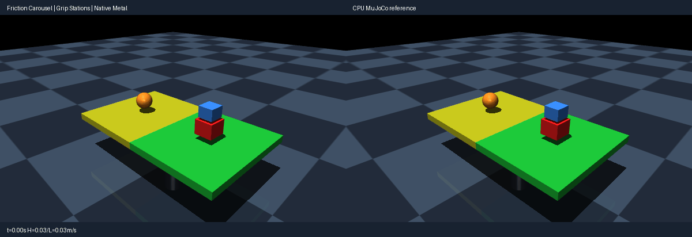

# Friction carousel (solver options, warm starts, no-slip)

Use the [shared source setup](../INSTALL.md#development-source), with its Python
environment active, and run these commands from the repository root.
This integrated demo requires current main source; it is not supported by the
published 0.4.0 wheel alone.

A motor-driven turntable (hinge + velocity servo, 1.5 rad/s target) carries
a stacked box pair on its high-grip half (pair friction 1.0) and a single
sphere on its low-grip half (pair friction 0.001). The high-grip stack
sticks and rides around; the low-grip sphere slips, spins, rolls off and
falls (caught by a floor that collides only with the low sphere to stay
within the 24-slot/96-row budget; cross rider/platform pairs are isolated
by contype groups). Elliptic cone, 600 iterations, tolerance 1e-4. Rest
equilibria with friction are non-unique, so the check gates grip contrast,
traverse, impact-transient and settle envelopes plus pre-impact parity, not
exact rest poses. Rendering uses MuJoCo OpenGL; playback speed is
presentation only, not a physics throughput claim.

Run a CPU reference smoke test:

```bash
PYTHONPATH=metal python metal/examples/friction_carousel.py --mode cpu --headless --check --steps 700
```

Run the native Metal comparison check on an Apple Silicon Mac:

```bash
PYTORCH_ENABLE_MPS_FALLBACK=0 PYTHONPATH=metal:metal/examples python metal/examples/friction_carousel.py --headless --check --steps 700
```

Record the side-by-side native Metal and CPU MuJoCo renders (left panel native,
right CPU):

```bash
PYTORCH_ENABLE_MPS_FALLBACK=0 PYTHONPATH=metal:metal/examples python metal/examples/friction_carousel.py --record metal/examples/assets/friction_carousel.gif --steps 700
```



The `--headless --check` run asserts actual native behavior: the low sphere
slips several times more than the high stack (high ~0.06 m/s, low ~0.33 m/s),
the high stack traverses with the platform (>0.05 m), the stack survives
(gap <0.15 m), early parity is exact (<5e-4), end parity stays within 3e-2
(position) / 0.2 (quat), and penetration stays below 0.02 m. Typical native
parity is ~0.6 mm position / 0.001 rad quat.
