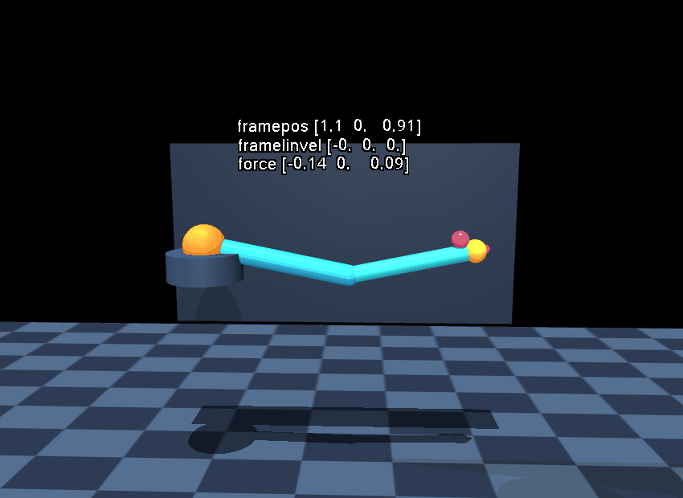

# Haptic Calligraphy



The clip records 5,000 native Euler steps (10 simulated seconds), displayed
at approximately 30 frames per second. Its 295 frames use MuJoCo's OpenGL
renderer; no second CPU simulation runs during recording. It is a visual
demonstration, not a performance measurement or a long-trajectory parity test.

This demo draws a small Lissajous loop with a planar, two-link articulated arm.
The pen tip follows the analytic target through a world-space Cartesian PD
wrench. The native extension measures the supplied VEL-stage site's current
world position and linear velocity, computes the target from device time, and
projects the wrench into generalized coordinates with the site's translational
Jacobian transpose. Built-in `framepos` and `framelinvel` sensors independently
show the measured world state.

The feedback plugin is a stateless `PluginType.FORCE` extension in
`mujoco_metal.site_feedback`. Its device callback requires current smooth
dynamics from the simulator and performs no host physics, host callback, or
runtime tensor readback. The demo registers a fresh plugin factory only while
the simulation exists, then unregisters it in a `finally` path.

Run from the repository root with the Metal Python package on `PYTHONPATH`:

```sh
PYTHONPATH=metal python metal/examples/haptic_calligraphy.py --mode cpu --headless --steps 300
PYTHONPATH=metal python metal/examples/haptic_calligraphy.py --mode metal --headless --check --steps 160
PYTHONPATH=metal python metal/examples/haptic_calligraphy.py --mode metal --headless --steps 900
PYTHONPATH=metal mjpython metal/examples/haptic_calligraphy.py --mode metal --render /tmp/haptic-calligraphy.gif --steps 5000
PYTHONPATH=metal mjpython metal/examples/haptic_calligraphy.py --mode metal --viewer-seconds 20
```

The CPU oracle is run only when `--check` is selected; ordinary Metal demo runs
do not advance a second host simulation. In check mode, native qpos/qvel/qacc
and world-sensor errors are reported against the pinned CPU trajectory.

The viewer and GIF renderer run MuJoCo's OpenGL renderer at the display
boundary. GIF export requires the optional Pillow package (`pip install pillow`).
It uses the same Pillow encoder as the other demo recordings. The target is a pink
sphere, the measured pen trail is magenta, and a gold connector visualizes the
instantaneous force direction. A live scene label reports `framepos`,
`framelinvel`, and world force. These markers are annotations only; the
simulation force comes from the registered native plugin. Lighting uses the
same directional `.9` diffuse / `.3` specular key as the marble music machine.

`test_site_feedback_019.py` contains an independent CPU oracle using
`mj_objectVelocity` and `mj_applyFT`, CPU Torch parity and readback guards, and
an opt-in native Euler batch/checkpoint/reset trajectory. Selected native tests
pass 120 steps in two worlds, exact checkpoint replay and partial reset against
MuJoCo 3.10.0. A separate installed development-wheel run also passes the
120-step CPU comparison, including world-frame sensors. These fixtures do not
qualify arbitrary plugins, other integrators or the complete physics backend.
