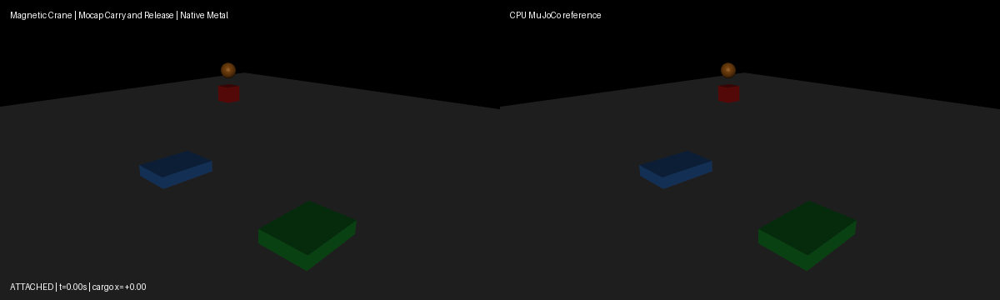

# Magnetic crane (mocap carry and release)

Use the [shared source setup](../INSTALL.md#development-source), with its Python
environment active, and run these commands from the repository root.
This integrated demo requires current main source; it is not supported by the
published 0.4.0 wheel alone.

A mocap hook carries a welded cargo box from staging to above the right bin,
then releases the weld through the public `sim.set_equality_active` API; the
cargo falls under gravity into the bin. Hook motion is prescribed
per-environment mocap input through the public `sim.set_mocap` API on a
deterministic schedule identical in CPU/native runs (hold 200 ms, translate to
the bin over 600 ms, hold, release at step 500 of 900, dt=0.002 s). A paired
always-attached run shows the physical effect of release. The simulation starts
from the compiled `start` keyframe via `sim.reset_to_keyframe`. Rendering uses
MuJoCo OpenGL; playback speed is presentation only, not a physics throughput
claim.

Run a CPU reference smoke test:

```bash
PYTHONPATH=metal python metal/examples/magnetic_crane.py --mode cpu --headless --steps 900
```

Run the native Metal comparison check on an Apple Silicon Mac:

```bash
PYTORCH_ENABLE_MPS_FALLBACK=0 PYTHONPATH=metal:metal/examples python metal/examples/magnetic_crane.py --headless --check --steps 900
```

Record the side-by-side native Metal and CPU MuJoCo renders (labels show
`ATTACHED`/`RELEASED` state and cargo position; left panel native, right CPU):

```bash
PYTORCH_ENABLE_MPS_FALLBACK=0 PYTHONPATH=metal:metal/examples python metal/examples/magnetic_crane.py --record metal/examples/assets/magnetic_crane.gif --steps 900
```

Launch the interactive viewer on a Mac:

```bash
./run mjpython metal/examples/magnetic_crane.py --steps 900
```



The `--headless --check` run asserts actual native behavior, not compilation:
weld force carries the cargo while attached and is removed after release, hook
body tracks the prescribed mocap target exactly, pre-release native/CPU pose
parity holds over the stable hold horizon, cargo contacts the bin, the released
cargo lands inside the right-bin footprint while the always-attached
counterfactual stays suspended, with zero bin contact when latched.

Measured native results on the qualified run (MuJoCo 3.10.0, MPS float32):

- Pre-release parity (100 stable hold steps): qpos `2.97e-07`, qvel `9.72e-06`.
- Full-run maxima (900 steps incl. carry + release): qpos `6.16e-07`, qvel `2.16e-05`.
- Native weld force before release: `3.93`; after release: `0.0`.
- Hook mocap tracking error: `0.0` (exact prescribed poses).
- Cargo contact steps: `218`; cargo-bin contact steps released/latched: `218` / `0`.
- Released cargo `(x, z)`: (`0.700`, `0.200`) inside right-bin footprint; latched cargo `(x, z)`: (`0.700`, `0.850`) suspended.
