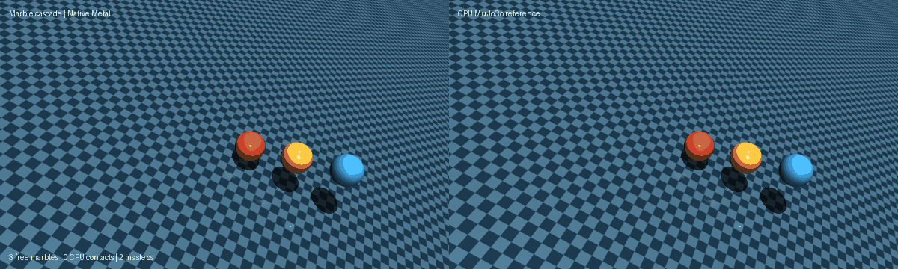

# Marble cascade

Three free marbles roll down a tilted, frictionless plane. Their staggered
initial velocities produce a sequence of sphere-sphere and plane-sphere normal
contacts. The left render shows `normal_contact_euler_v1`; the right render
shows an independent CPU MuJoCo `mj_step` reference from the same initial
state. The model uses only three free bodies, one plane, and `condim=1`.

From the repository root, run the headless parity check on a Mac with MPS:

```sh
PYTHONPATH=metal PYTORCH_ENABLE_MPS_FALLBACK=0 python metal/examples/marble_cascade.py --headless --check
```

Use `--mode cpu` for a CPU-only execution. To record the actual native and CPU
simulations side by side, install Pillow and pass a destination:

```sh
PYTHONPATH=metal python metal/examples/marble_cascade.py --headless --record metal/examples/assets/marble_cascade.gif
```

The renderer samples the running states every 40 ms of simulated time. The
GIF plays those recorded frames at 25 frames per second; recording time does
not represent simulation speed. `--check` runs 600 Euler steps at 2 ms each,
requires sustained contact, and bounds maximum position and velocity error
against CPU MuJoCo.


