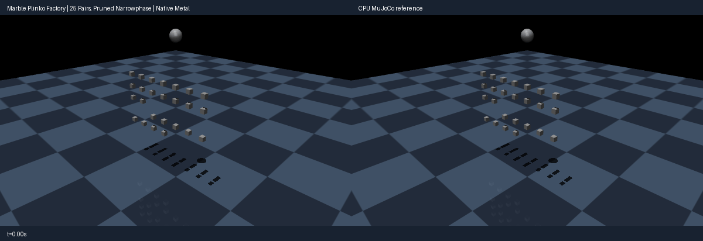

# Marble plinko factory (capacity demo)

A marble drops through a 25-peg static field under gravity: 25 candidate
pairs / 25 slots / 81 rows, exceeding the old 16-pair / 24-slot ceilings
with rows inside the 96-row budget. Broadphase pruning skips distant pegs
every step (see `test_pruning_on_off_physics_equivalence_gpu`); peak
active/allocated counts are asserted in
`test_raised_ceilings_admit_beyond_old_caps_cpu`. 16 pegs carry friction
(condim 3), 9 are frictionless (condim 1), the marble is condim 1; the
floor plane is decorative (the ball stays high, guarded by `min_ball_z`).

Run:
```sh
./run --cpu python metal/examples/marble_plinko.py --headless --check --steps 600 --mode cpu
./run python metal/examples/marble_plinko.py --headless --check --steps 600 --mode metal
./run python metal/examples/marble_plinko.py --headless --steps 600 --mode metal --record metal/examples/assets/marble_plinko.gif
```


