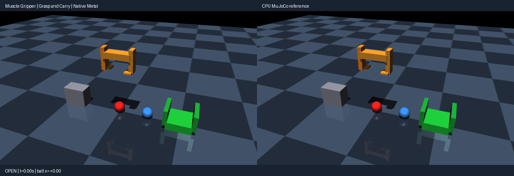

# Muscle gripper (antagonistic muscle actuation)

Use the [shared source setup](../INSTALL.md#development-source), with its Python
environment active, and run these commands from the repository root.
This integrated demo requires current main source; it is not supported by the
published 0.4.0 wheel alone.

A mocap gantry carries two muscle-driven fingers. Each hinge joint is driven by
an antagonistic flexor/extensor pair using MuJoCo muscle dynamics
(`dyntype="muscle"` with activation state), force-length-velocity gains
(`gaintype="muscle"`) and passive force biases (`biastype="muscle"`).
Phase A grasps a red sphere (r=0.055, 0.25 kg), carries it over a walled bin
and sets it down inside. Phase B grasps a blue sphere (r=0.055, 0.15 kg),
carries it to a pedestal and sets it down on top. Gantry motion and finger
schedules are deterministic open-loop inputs identical in CPU/native runs
(2700 steps, dt=0.002 s). A paired always-open run shows the physical effect
of grasping. The simulation starts from the compiled `start` keyframe via
`sim.reset_to_keyframe`. Rendering uses MuJoCo OpenGL; playback speed is
presentation only, not a physics throughput claim.

Run a CPU reference smoke test:

```bash
PYTHONPATH=metal python metal/examples/muscle_gripper.py --mode cpu --headless --steps 2700
```

Run the native Metal comparison check on an Apple Silicon Mac:

```bash
PYTORCH_ENABLE_MPS_FALLBACK=0 PYTHONPATH=metal:metal/examples python metal/examples/muscle_gripper.py --headless --check --steps 2700
```

Record the side-by-side native Metal and CPU MuJoCo renders (left panel native,
right CPU):

```bash
PYTORCH_ENABLE_MPS_FALLBACK=0 PYTHONPATH=metal:metal/examples python metal/examples/muscle_gripper.py --record metal/examples/assets/muscle_gripper.gif --steps 2700
```

Launch the interactive viewer on a Mac:

```bash
./run mjpython metal/examples/muscle_gripper.py --steps 2700
```



The `--headless --check` run asserts actual native behavior: muscle activation
state advances on device, finger contacts occur on grasp steps, the released
ball lands inside the bin footprint while the always-open counterfactual stays
outside, and the second ball lands on the pedestal top.

Measured CPU results on the qualified run (MuJoCo 3.10.0):

- Ball delivered `(x, z)`: (`0.591`, `0.135`) inside bin footprint; always-open `(x, z)`: (`-3.667`, `0.055`) on floor.
- Second ball placed `(x, z)`: (`-0.056`, `0.255`) on pedestal top (z=0.2); always-open stays at (`0.300`, `0.055`).
- Ball-bin contact steps: `1416`; finger contact steps: `356`.
- Full-run native/CPU parity on focused actuator fixtures (see milestone 007
  report): integrator/filter/filter-exact qpos `1.6e-07`, muscle `2e-03`.

Known gap: the full two-grasp demo currently diverges between native GPU and
CPU during the contact-rich carry (GPU ejects the first ball;
`results/milestone-007/failures/gpu-demo-divergence.log`). Focused
actuator/transmission fixtures pass native parity; the full-demo native check
is deferred until the contact-divergence root cause is addressed. The demo is
CPU-qualified; native demo parity remains open.
