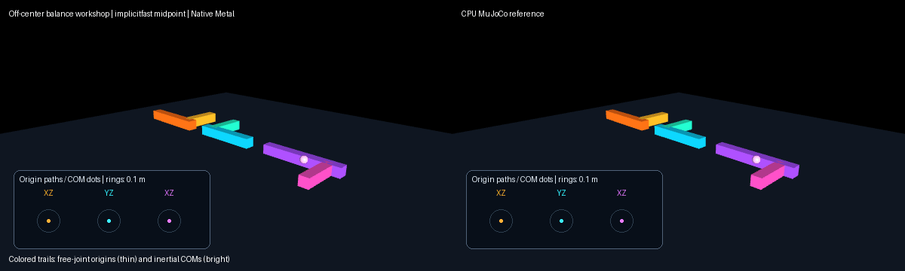

# Off-center balance workshop

Use the [shared source setup](../INSTALL.md#development-source), with its Python
environment active, and run these commands from the repository root.

This scene shows three free rigid tools with different inertial COM offsets.
They begin with nearly stationary COMs and nonzero angular velocity, so each
joint origin follows a visible arc while its measured COM stays close to its
initial position. The bright L-shaped geoms are visual guides; contacts are
disabled and the example makes no collision or force-sensing claim.

Run a CPU-only reference preview with:

```sh
PYTHONPATH=metal:metal/examples python metal/examples/offcenter_balance.py --mode cpu --headless --steps 1800
```

On a supported Apple GPU, compare the native implicitfast midpoint profile to
an independent MuJoCo CPU rollout with:

```sh
PYTHONPATH=metal:metal/examples python metal/examples/offcenter_balance.py --headless --check --steps 1800
```

Record side-by-side native and CPU panels, including COM/origin path plots,
with:

```sh
PYTHONPATH=metal:metal/examples python metal/examples/offcenter_balance.py --headless --record metal/examples/assets/offcenter_balance.gif
```

The free bodies are standalone, contact-free and awake, with zero fluid
density/viscosity and inverse-discrete dynamics disabled. Those are the
eligibility conditions for MuJoCo 3.10's free-body midpoint branch. The
midpoint advances angular velocity in the principal-inertia frame and, for an
offset COM, solves the corresponding analytic midpoint translation. The CPU
test suite compares qpos, qvel, and reported qacc against actual `mj_step`,
including an articulated free-body tree that correctly remains on the
ordinary implicitfast path.



The recorded 1,800-step run has maximum absolute qpos/qvel differences of
`3.20e-5` / `2.58e-5`. Each panel plots its own measured trajectories relative
to each body's initial center of mass, in the labeled world-coordinate plane.
The faint circles have radius 0.1 m. These checks describe this fixture; the
clip is not a performance comparison.
