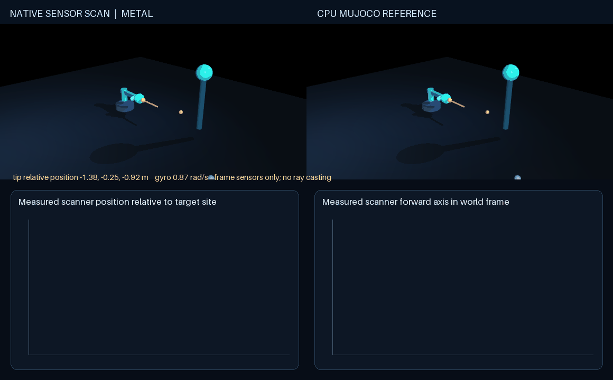

# Sensor scanning rig

Use the [shared source setup](../INSTALL.md#development-source), with its Python
environment active, and run these commands from the repository root.

The pan/tilt rig sweeps a sensor site across a fixed target marker. Its charts
plot the measured site position relative to the target frame and the measured
forward-axis direction. The example also reads gyro, velocimeter, frame linear
velocity, and joint sensors from the current state. These are MuJoCo frame
measurements; **the rig does not ray cast or report surface depth**.

Native Metal uses the `contact_free_sensor_euler_v1` profile with two scalar
motors. It runs beside CPU MuJoCo under the same controls. The check compares
position, velocity, and the current-state sensor query over a short rollout.
Rendering and sensor readback happen outside the native stepping loop.

From the repository root, run a CPU-only fixture check with:

```sh
PYTHONPATH=metal python metal/examples/scanning_rig.py \
  --mode cpu --headless --check --steps 160
```

On an MPS-enabled Mac, compare native Metal with MuJoCo using the pinned Python
environment and keep MPS fallback disabled:

```sh
PYTHONPATH=metal PYTORCH_ENABLE_MPS_FALLBACK=0 python metal/examples/scanning_rig.py \
  --mode metal --headless --check --steps 160
```

Save an actual rendered comparison GIF with:

```sh
PYTHONPATH=metal PYTORCH_ENABLE_MPS_FALLBACK=0 python metal/examples/scanning_rig.py \
  --mode metal --headless --record metal/examples/assets/scanning_rig.gif \
  --record-seconds 4
```

Offscreen rendering still needs MuJoCo's OpenGL renderer. The interactive mode
uses the passive MuJoCo viewer; launch with `mjpython` on macOS and add `--viewer-seconds 10` to end it after ten
seconds. `--mode cpu` runs both sides through CPU MuJoCo for a visual baseline.


