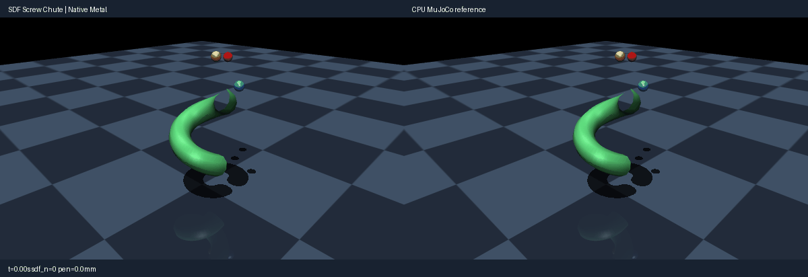

# SDF screw chute (signed-distance contact)

Use the [shared source setup](../INSTALL.md#development-source), with its Python
environment active, and run these commands from the repository root.
This integrated demo requires current main source; it is not supported by the
published 0.4.0 wheel alone.

A static signed-distance chute (procedural helical tube mesh with authored
vertex lists) guides three spheres from pre-placed bore positions to the
floor. Ball/chute and floor contacts exercise the native Halton-seeded
gradient-descent SDF narrow phase against mesh-octree SDFs, with a live
contact-count and penetration overlay in the caption band. One ball threads
the helix eye (testing no-spurious-contact); the others ride the walls.
Rest equilibria with friction are non-unique, so the check gates
traverse/exit, impact-transient and settle envelopes plus early parity, not
exact spots. Rendering uses MuJoCo OpenGL; playback speed is presentation
only, not a physics throughput claim.

Run a CPU reference smoke test:

```bash
PYTHONPATH=metal python metal/examples/sdf_chute.py --mode cpu --headless --check --steps 900
```

Run the native Metal comparison check on an Apple Silicon Mac:

```bash
PYTORCH_ENABLE_MPS_FALLBACK=0 PYTHONPATH=metal:metal/examples python metal/examples/sdf_chute.py --headless --check --steps 900
```

Record the side-by-side native Metal and CPU MuJoCo renders (left panel native,
right CPU):

```bash
PYTORCH_ENABLE_MPS_FALLBACK=0 PYTHONPATH=metal:metal/examples python metal/examples/sdf_chute.py --record metal/examples/assets/sdf_chute.gif --steps 900
```



The `--headless --check` run asserts actual native behavior: all three balls
exit the tube and settle on the floor, SDF contacts engage through the
traverse, penetration stays within the compliant impact bound, and
native/CPU positions agree to micrometers early and millimeters at settle.
Cargo-cargo pairs are excluded (staggered starts, budget); the thin tube
walls are single-sided open mesh (documented SDF sign behavior at rims).
Mesh-SDF pairs, plugin SDFs, heightfield-SDF and margin stay restricted
(documented 013 scope), and `sdf_initpoints` above the per-pair budget is
rejected at lowering.

Lighting and the dark checkerboard match the robotic marble music machine.
