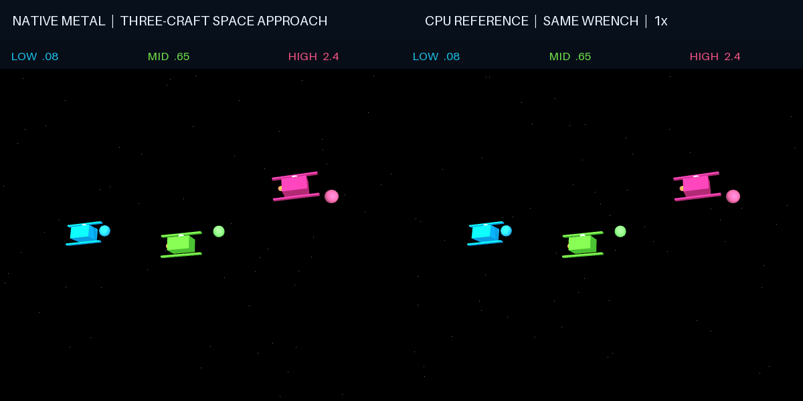

# Spacecraft approach and formation flight

Use the [shared source setup](../INSTALL.md#development-source), with its Python
environment active, and run these commands from the repository root.

Three free-floating craft chase moving targets with different linear damping.
Applied forces change their paths; body-local torques make them tumble. The
left panel uses native Metal physics, and the right panel uses CPU MuJoCo with
exactly the same generalized-force inputs.

This is a **contact-free approach demo**: colored target markers are visual only,
and the craft do not collide or latch. The host-side controller and wrench
projection use MuJoCo utilities; this does not demonstrate native actuator models
or native Cartesian-force projection. The native simulation handles generalized
forces, mass/bias, acceleration solves and quaternion-aware Euler integration.
Display and readback are outside any performance claim.



The four-second recording passed with maximum position and velocity differences
of approximately `1.01e-5` and `2.91e-6` across the scenario. This is one short
fixture, not a universal error bound or a long-horizon qualification.

## Run locally

From the repository root, use the isolated installation in the
[Metal README](../README.md), plus Pillow for PNG/GIF output:

```sh
python -m pip install pillow
PYTORCH_ENABLE_MPS_FALLBACK=0 python metal/examples/space_docking.py \
  --mode metal --headless --check --steps 200
PYTORCH_ENABLE_MPS_FALLBACK=0 mjpython metal/examples/space_docking.py --mode metal
```

The interactive command needs an active macOS display. `mjpython` can wait for a
GUI session before the script starts; use ordinary Python with `--headless` when
no display is available. Use `--mode cpu` for a CPU-only visual baseline.

## Record the simulation

```sh
PYTORCH_ENABLE_MPS_FALLBACK=0 python metal/examples/space_docking.py \
  --mode metal --headless --steps 200 --image /tmp/space-docking.png
PYTORCH_ENABLE_MPS_FALLBACK=0 python metal/examples/space_docking.py \
  --mode metal --headless --steps 1 \
  --record metal/examples/assets/space_docking.gif --record-seconds 4
```

Offscreen images still use MuJoCo's OpenGL renderer. The GIF plays at one
simulated second per playback second; it does not show measured execution speed.
The recording has a bounded duration and its final report includes numerical
errors. `--check` is a separate short-rollout gate, limited to 200 steps.

## What to watch

- Low-damping craft keep rotating and drifting more readily; high-damping craft
  resist motion under the same type of controller.
- Marker paths change over time, so the controller continues adjusting forces.
- Native and CPU motion should agree closely over this short scenario. They are
  independently integrated; the reference is not a copy of the native state.

The synthetic craft geometry is included in the XML. No external robot assets
are required. This example implements a conventional external controller and
uses existing rigid-body dynamics methods; it is not a new control algorithm.
