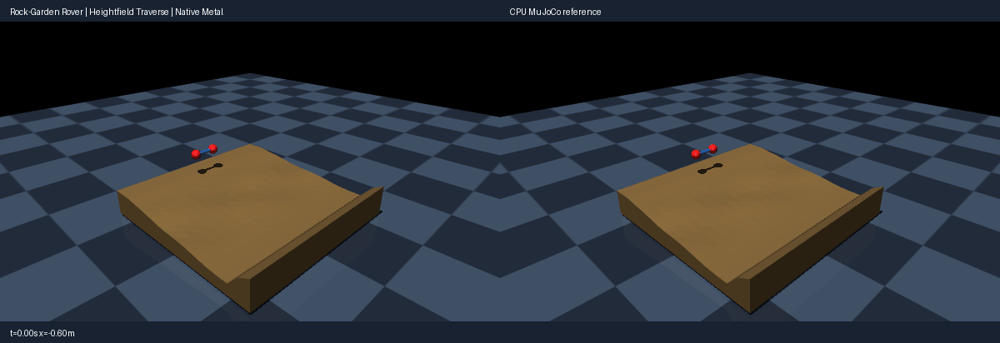

# Rock-garden axle cart (heightfield contact)

Use the [shared source setup](../INSTALL.md#development-source), with its Python
environment active, and run these commands from the repository root.
This integrated demo requires current main source; it is not supported by the
published 0.4.0 wheel alone.

A passive two-wheel axle cart (two sphere wheels fixed to a free body with a
visual axle capsule) launches with a small push and rolls across a
procedurally built heightfield: start pad, sine rock garden, catch flat and
stop berm. Gravity plus Coulomb friction (elliptic cone) drive it across
multiple terrain cells; wheel/terrain contacts exercise native per-prism
heightfield narrow phase (one witness per overlapped terrain prism, same
traversal order as the pinned engine). Rest equilibria with friction are
non-unique, so the check gates traverse distance, rolling, clearance,
impact-transient and settle envelopes plus early parity, not exact rest poses.
Rendering uses MuJoCo OpenGL; playback speed is presentation only, not a
physics throughput claim.

Run a CPU reference smoke test:

```bash
PYTHONPATH=metal python metal/examples/terrain_rover.py --mode cpu --headless --check --steps 800
```

Run the native Metal comparison check on an Apple Silicon Mac:

```bash
PYTORCH_ENABLE_MPS_FALLBACK=0 PYTHONPATH=metal:metal/examples python metal/examples/terrain_rover.py --headless --check --steps 800
```

Record the side-by-side native Metal and CPU MuJoCo renders (left panel native,
right CPU):

```bash
PYTORCH_ENABLE_MPS_FALLBACK=0 PYTHONPATH=metal:metal/examples python metal/examples/terrain_rover.py --record metal/examples/assets/terrain_rover.gif --steps 800
```



The `--headless --check` run asserts actual native behavior: the cart travels
over a meter through the garden and settles at the berm, the body rolls
(2.3 rad), the axle never tunnels the solid, penetration stays within the
compliant impact bound, and native/CPU positions agree exactly early and to
lane precision at settle (rolling orientation uses a phase envelope, as in
the roller workshop). The thin axle capsule is intentionally collision-free
(contype 0, documented) so the pair budget covers the two 8-slot wheel pairs;
mesh-heightfield and heightfield-heightfield pairs stay rejected (documented
012 restrictions), and margin is qualified at 0 only.

Lighting and the dark checkerboard match the robotic marble music machine.
