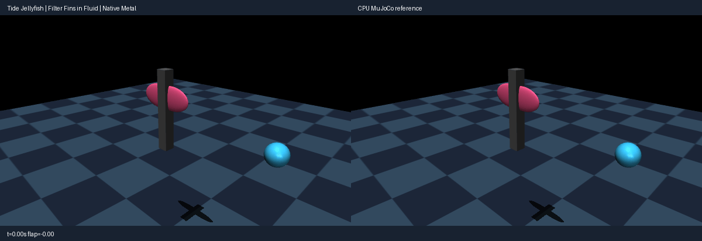

# Tide jellyfish (integrators, passive forces, fluid derivatives)

Use the [shared source setup](../INSTALL.md#development-source), with its Python
environment active, and run these commands from the repository root.
This integrated demo requires current main source; it is not supported by the
published 0.4.0 wheel alone.

Two stateful filter-actuated ellipsoid fins flap in antiphase on a fixed
mount under reduced gravity, viscosity and a steady current; a passive
sphere drifts with the current. Fin geoms use the per-geom ellipsoid fluid
model (added-mass plus Magnus/Kutta lift plus blunt/slender/angular viscous
terms); the sphere uses the inertia-box model. The modeled fluid is MuJoCo's
analytic approximation (drag + lift on equivalent ellipsoids), not a full
fluid simulator. Drift equilibria are non-unique, so the check gates flap
amplitude, drift, impact-transient and settle envelopes plus pre-impact
parity, not exact rest poses. Rendering uses MuJoCo OpenGL; playback speed
is presentation only, not a physics throughput claim.

Run a CPU reference smoke test:

```bash
PYTHONPATH=metal python metal/examples/tide_jellyfish.py --mode cpu --headless --check --steps 600
```

Run the native Metal comparison check on an Apple Silicon Mac:

```bash
PYTORCH_ENABLE_MPS_FALLBACK=0 PYTHONPATH=metal:metal/examples python metal/examples/tide_jellyfish.py --headless --check --steps 600
```

Record the side-by-side native Metal and CPU MuJoCo renders (left panel native,
right CPU):

```bash
PYTORCH_ENABLE_MPS_FALLBACK=0 PYTHONPATH=metal:metal/examples python metal/examples/tide_jellyfish.py --record metal/examples/assets/tide_jellyfish.gif --steps 600
```



The `--headless --check` run asserts actual native behavior: fin flap
amplitude above 0.15 rad (measured ~0.37), floater drift above 0.05 m
(measured ~0.33), early parity exact (<5e-4), end parity within 3e-2
(position) / 5e-2 (velocity). Typical native parity is sub-micro
(~4e-7 position).
