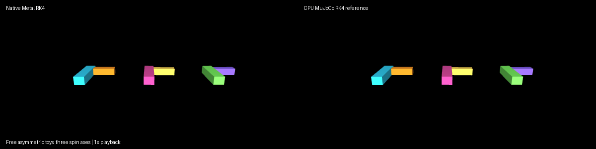

# Tumbling toys: choose your spin axis

Use the [shared source setup](../INSTALL.md#development-source), with its Python
environment active, and run these commands from the repository root.

Three colorful asymmetric toys spin freely around different initial axes.
Their rotations evolve without a controller, showing the orientation dynamics
of asymmetric rigid bodies and exercising quaternion-aware native RK4.



From the repository root, using the current source and a Python 3.12 environment
with the Metal dependencies installed:

```sh
PYTHONPATH=metal PYTORCH_ENABLE_MPS_FALLBACK=0 python metal/examples/tumbling_toys.py
PYTHONPATH=metal PYTORCH_ENABLE_MPS_FALLBACK=0 python metal/examples/tumbling_toys.py --record metal/examples/assets/tumbling_toys.gif
```

Recording additionally requires Pillow and an offscreen MuJoCo OpenGL context.
The script checks every step against an independent CPU MuJoCo RK4 trajectory;
`--mode cpu` provides a reference-only run. The GIF is actual simulation at 1x
playback, not a speed comparison. The default 1,000-step M1 Max run observed
maximum qpos error 2.00e-6 and qvel error 7.35e-6. This qualifies this fixture,
not arbitrary RK4 models. No contacts, gravity, sensors or actuators are used.
The demo requires the RK4 profiles introduced in version 0.4.0.
